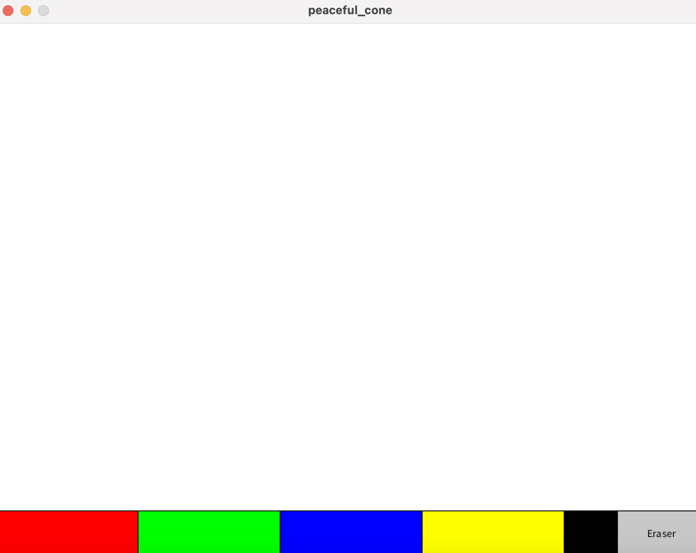

# Processing?

Привет! Сегодня, в небольшой статье поговорим о такой штуке как processing.

## Что такое этот ваш Processing?

Начнем с того что такое Processing? 

**Processing** — открытый яп, основанный на java. Представляет собой лёгкий и быстрый инструментарий для создания изображений, анимации и разработки интерфейсов.

Используется студентами, художниками, дизайнерами, исследователями для изучения, прототипирования и производства. Он создан для изучения основ программирования

## Зачем и для чего?

Продолжим наш разговор ответом на вопрос: "А зачем нужен это нужно?". Ответ будет довольно простым - для обучения и написания приложений.  Если судить по официальному сайту то Processing - это довольно мощный язык на котором можно писать приложения для десктопных систем, android, ios, а также можно создавать web-приложения. 

## Почему похоже на ардуино?

Важным аспектом который мы сегодня затронем в этой статье будет схожесть processing   и ардуино.   У тех кто уже знаком с ардуино, мог возникнуть вполне логичный вопрос: "Откуда такая схожесть с ардуино?". Я отвечу на этот вопрос, одной из идей, а также вдохнорвителем создателей arduino был Processing.

## Установка 

Итак, наконец можем перейти к установке Processing. На момент написания статьи вышел Processing 4, следовательно мы цбудем использовать именно эту версию.
первым делом скачайте Processing:
   - Перейдите на [официальный сайт Processing](https://processing.org/download/) и скачайте версию для вашей операционной системы.
Далее установите его и запустите его.
   - Распакуйте загруженный архив и запустите файл `processing` (или `processing.exe` на Windows).
Запустите появившееся приложение.![[Снимок экрана 2025-04-18 в 20.08.55.png]]
Перед вами откроется такой интерфейс. Правда напоминает ардуино?
Не пугайтесь сразу что ничего нет - это нормально. 
Теперь можем немного разобраться с синтаксисом языка. 

## Синтаксис
### 1. `setup()`

Функция `setup()` вызывается один раз при запуске программы. Здесь вы можете установить начальные параметры, такие как размер окна и цвет фона.

```java
void setup() {
  size(800, 600); // Установка размера окна
  background(255); // Установка белого фона
}
```

Окно создается при помощи команды `size(width, heigth);`


### 2. `draw()`

Функция `draw()` вызывается в цикле и используется для обновления экрана. Здесь вы можете рисовать графику и анимацию.

```java
void draw() {
  background(255); // Очистка фона
  fill(0); // Установка цвета заливки
  ellipse(mouseX, mouseY, 50, 50); // Рисование круга в позиции мыши
}
```

### 3. Рисование форм

Processing предоставляет простые команды для рисования различных форм:

- `line(x1, y1, x2, y2)` — рисует линию.
- `rect(x, y, width, height)` — рисует прямоугольник.
- `ellipse(x, y, width, height)` — рисует круг или эллипс.
- `triangle(x1, y1, x2, y2, x3, y3)` — рисует треугольник.

### Пример рисования

```java
void setup() {
  size(400, 400);
}

void draw() {
  background(255);
  fill(150, 0, 0);
  rect(50, 50, 100, 100); // Рисуем красный квадрат
  fill(0, 150, 0);
  ellipse(200, 200, 100, 100); // Рисуем зеленый круг
}
```


## Пример 1: Создание простого приложения - Paint
Я не буду томить большим количеством текста, но вот полный код, чуть ниже разберем его подробно.

```java
int brushColor = color(0); // Цвет кисти
int brushSize = 5; // Размер кисти
boolean isDrawing = false; // Флаг рисования
boolean eraserMode = false; // Режим ластика

void setup() {
  size(800, 600); // Размер окна
  background(255); // Белый фон
}

void draw() {
  // Если мышь нажата, рисуем или стираем
  if (isDrawing) {
    if (eraserMode) {
      stroke(255); // Цвет фона для ластика
    } else {
      stroke(brushColor);
    }
    strokeWeight(brushSize);
    line(mouseX, mouseY, pmouseX, pmouseY);
  }
  
  // Отрисовка палитры
  drawPalette();
}

void mousePressed() {
  if (mouseY < height - 50) {
    isDrawing = true; // Начинаем рисовать или стирать
  } else {
    // Проверка нажатия на палитру
    if (mouseX < width / 5) {
      brushColor = color(255, 0, 0); // Красный
    } else if (mouseX < 2 * width / 5) {
      brushColor = color(0, 255, 0); // Зеленый
    } else if (mouseX < 3 * width / 5) {
      brushColor = color(0, 0, 255); // Синий
    } else if (mouseX < 4 * width / 5) {
      brushColor = color(255, 255, 0); // Желтый
    } else {
      brushColor = color(0); // Черный
    }
  }
}

void mouseReleased() {
  isDrawing = false; // Заканчиваем рисовать или стирать
}

void drawPalette() {
  // Отрисовка палитры цветов
  fill(255);
  rect(0, height - 50, width, 50);
  
  fill(255, 0, 0);
  rect(0, height - 50, width / 5, 50);
  
  fill(0, 255, 0);
  rect(width / 5, height - 50, width / 5, 50);
  
  fill(0, 0, 255);
  rect(2 * width / 5, height - 50, width / 5, 50);
  
  fill(255, 255, 0);
  rect(3 * width / 5, height - 50, width / 5, 50);
  
  fill(0);
  rect(4 * width / 5, height - 50, width / 5, 50);
  
  // Отрисовка размера кисти
  fill(brushColor);
  ellipse(width - 50, height - 25, brushSize * 2, brushSize * 2);
  
  // Кнопка для ластика
  fill(200);
  rect(width - 100, height - 50, 100, 50);
  fill(0);
  textAlign(CENTER, CENTER);
  text("Eraser", width - 50, height - 25);
}

void mouseWheel(MouseEvent event) {
  // Изменение размера кисти с помощью колеса мыши
  brushSize += event.getCount();
  brushSize = constrain(brushSize, 1, 50); // Ограничение размера кисти
}

void mouseClicked() {
  // Проверка нажатия на кнопку ластика
  if (mouseX > width - 100 && mouseX < width && mouseY > height - 50 && mouseY < height) {
    eraserMode = !eraserMode; // Переключаем режим ластика
  }
}
```
### **Объяснение кода:**

1. **`setup()`**  
   - Выполняется один раз при запуске.  
   - `size(800, 600)` – задаёт размер окна.  
   - `background(255)` – делает фон белым.  

2. **`draw()`**  
   - Выполняется в цикле (как `while(true)`).  
   - `stroke()` – задаёт цвет линии.  
   - `strokeWeight()` – толщина кисти.  
   - `line(x1, y1, x2, y2)` – рисует линию от точки (x1,y1) до (x2,y2).  

3. **Обработка мыши**  
   - `mousePressed()` – срабатывает при нажатии кнопки мыши.  
   - `mouseReleased()` – при отпускании.  
   - `mouseWheel()` – при прокрутке колеса (`event.getCount()` даёт направление).  
   - `mouseClicked()` – при клике (нажатие + отпускание).  
   - `mouseX`, `mouseY` – текущие координаты курсора.  
   - `pmouseX`, `pmouseY` – предыдущие координаты (для плавных линий).  

4. **Рисование фигур**  
   - `rect(x, y, w, h)` – прямоугольник.  
   - `ellipse(x, y, w, h)` – круг/овал.  
   - `fill()` – цвет заливки.  

5. **Текст**  
   - `text("текст", x, y)` – выводит текст.  
   - `textAlign(CENTER, CENTER)` – выравнивание по центру.  

6. **Логика**  
   - `boolean` – переменная-флаг (`true`/`false`).  
   - `if (условие) { ... }` – проверка условий.  
   - `constrain(значение, мин, макс)` – ограничивает число в диапазоне.  

---

### **Как это работает?**  
1. **Рисование**  
   - Если зажата кнопка мыши (`isDrawing = true`), программа рисует линию от прошлых координат (`pmouseX/Y`) к текущим (`mouseX/Y`).  
   - В режиме ластика (`eraserMode = true`) цвет линии белый (`stroke(255)`).  

2. **Палитра**  
   - Внизу экрана (`height - 50`) – 5 цветных прямоугольников (`rect`).  
   - Клик по ним меняет `brushColor`.  

3. **Ластик и размер кисти**  
   - Клик по кнопке `Eraser` переключает `eraserMode`.  
   - Прокрутка колеса (`mouseWheel`) меняет `brushSize`.  

Проще говоря - это простая рисовалка на Processing, где используются базовые команды для работы с графикой (`rect`, `line`, `ellipse`), обработки мыши (`mouseX`, `mousePressed`) и логики (`if`, `boolean`).


## Работа с Ардуино

## Пример 2: Управление светодиодом через GUI в Processing  
### **Arduino-скетч**  
```cpp
void setup() {
  Serial.begin(9600);
  pinMode(13, OUTPUT);  // Светодиод на 13 пине
}

void loop() {
  if (Serial.available()) {
    char cmd = Serial.read();
    if (cmd == '1') digitalWrite(13, HIGH);  // Включить
    if (cmd == '0') digitalWrite(13, LOW);   // Выключить
  }
}
```
Тут мы просто читаем команды которые приходят в serial  и в зависимости от того что приходит мыт либо включаем светодиод, либо выключаем его
### **Processing-скетч**  
```java
import processing.serial.*;

Serial myPort;
boolean ledState = false;

void setup() {
  size(300, 200);
  myPort = new Serial(this, "COM3", 9600);  // Укажите ваш COM-порт
  surface.setTitle("LED Control");
}

void draw() {
  background(220);
  fill(ledState ? color(0, 255, 0) : color(255, 0, 0));
  ellipse(width/2, height/2, 100, 100);
  fill(0);
  text("Click to toggle LED", width/2 - 50, height/2 + 70);
}

void mousePressed() {
  if (dist(mouseX, mouseY, width/2, height/2) < 50) {
    ledState = !ledState;
    myPort.write(ledState ? '1' : '0');  // Отправка команды
  }
}
```

### **Разбор кода** 

- **Импорт библиотеки Serial**
    
    - `import processing.serial.*;` – подключает библиотеку для работы с COM-портом.
        
- **`setup()`**
    
    - `size(300, 200)` – создаёт окно 300×200 пикселей.
        
    - `myPort = new Serial(this, "COM3", 9600)` – открывает COM-порт (замени `"COM3"` на свой).
        
    - `surface.setTitle("LED Control")` – устанавливает заголовок окна.
        
- **`draw()`**
    
    - `background(220)` – серый фон.
        
    - `fill(ledState ? color(0, 255, 0) : color(255, 0, 0))` – если `ledState = true`, круг зелёный, иначе красный.
        
    - `ellipse(width/2, height/2, 100, 100)` – рисует круг по центру.
        
    - `text("Click to toggle LED", ...)` – выводит подпись.
        
- **`mousePressed()`**
    
    - `dist(mouseX, mouseY, width/2, height/2) < 50` – проверяет, попал ли клик в круг.
        
    - `ledState = !ledState` – переключает состояние светодиода (`true`/`false`).
        
    - `myPort.write(ledState ? '1' : '0')` – отправляет `'1'` (включить) или `'0'` (выключить) в Arduino.


## Заключение
Processing — мощный инструмент для создания визуальных проектов. С помощью простого синтаксиса и богатого набора функций вы можете быстро реализовать свои идеи. Есть возможность работать совместно с ардуино. Изучить Processing децствительно просто и в статье мы постарались быстро пройтись по основам языка, но для более глубокого изучения возможностей Processing, можете прочитать прекрасно написанную  [официальную документацию](https://processing.org/reference/).
