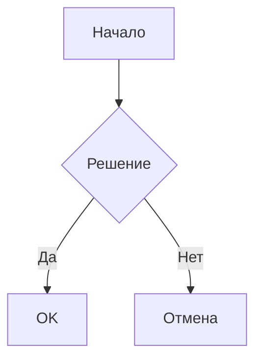

# Obsidian: Твой личный центр знаний 🧠

Привет! 👋 Сегодня поговорим про Obsidian - это такая крутая программа для ведения заметок. Я сам ей пользуюсь каждый день и хочу поделиться фишками, которые реально упрощают жизнь.

## Что такое Obsidian?

Представь себе блокнот со сверхспособностями! Obsidian - это не просто редактор заметок, а целая система для создания личной базы знаний. Все заметки хранятся в обычных Markdown файлах на твоем компьютере (никакого облака, если ты сам этого не захочешь).

## Основы Markdown в Obsidian

Давай быстренько пробежимся по основам разметки:

```markdown
# Заголовок 1
## Заголовок 2
### Заголовок 3

**Жирный текст**
*Курсив*
~~Зачеркнутый текст~~

- Список
- Еще пункт
  - Вложенный пункт

1. Нумерованный список
2. Второй пункт

> Цитата
> Продолжение цитаты

[[Ссылка на другую заметку]]
```

## Топ плагинов для Obsidian 🔌

### 1. Calendar
Календарь прямо в сайдбаре! Можно:
- Видеть, в какие дни ты делал заметки
- Быстро создавать ежедневные заметки
- Планировать задачи

### 2. Dataview
Это просто магия! Позволяет делать SQL-подобные запросы к твоим заметкам:
```dataview
TABLE file.ctime AS "Created",
      file.mtime AS "Updated"
FROM "Projects"
SORT file.mtime DESC
```

### 3. Kanban
Создавай доски в стиле Trello прямо в заметках:
```markdown
---

## Бэклог

- [ ] Придумать структуру заметок
- [ ] Настроить плагины

## В работе

- [ ] Писать статью про Obsidian

## Готово

- [x] Установить Obsidian
```

### 4. Mind Map
Преврати любой список в красивую ментальную карту:
```markdown
# Мой проект
## Задачи
### Дизайн
### Разработка
### Тестирование
## Ресурсы
### Время
### Бюджет
```

### 5. Templates
Шаблоны для заметок. Супер-удобно для:
- Ежедневных заметок
- Заметок о книгах
- Заметок о проектах

Пример шаблона для книги:
```markdown
---
title: {{title}}
author: 
date: {{date}}
tags: book, reading
---

# Краткое содержание

# Ключевые идеи

# Цитаты

# Мои мысли
```

### 6. Advanced Tables
Мощный инструмент для работы с таблицами:
- Автоформатирование таблиц
- Сортировка данных
- Формулы в ячейках

Пример:
```markdown
| Проект | Статус | Дедлайн |
|--------|---------|----------|
| Сайт   | В работе| 2024-04-01 |
| Блог   | Готово  | 2024-03-15 |
```

### 7. Outliner
Делает работу со списками удобнее:
- Перетаскивание пунктов
- Сворачивание/разворачивание
- Zoom на определенный пункт

### 8. Spaced Repetition
Для изучения материала по методу интервального повторения:
```markdown
#flashcard
Вопрос: Что такое Markdown?
?
Ответ: Легкий язык разметки для создания форматированного текста
```

## Крутые фишки Markdown в Obsidian

### Callouts (выделенные блоки)
```markdown
> [!INFO] 
> Это информационный блок

> [!WARNING]
> А это предупреждение!

> [!TIP]
> Полезный совет
```

### Чекбоксы с разными статусами
```markdown
- [ ] Обычная задача
- [x] Выполненная задача
- [/] В процессе
- [-] Отменена
- [?] Нужна информация
```

### Встроенные изображения
```markdown
![[картинка.png]]
![[картинка.png|100x100]] # С указанием размера
```

## Симуляторы и интеграции 🔗

### 1. Excalidraw
Встроенный редактор для рисования схем:
- Рисуй прямо в заметках
- Сохраняй схемы как часть базы знаний
- Легко редактируй потом

### 2. Mermaid
Создавай диаграммы прямо в тексте:


### 3. Math
Поддержка LaTeX для формул:
```markdown
$$
E = mc^2
$$
```

## Советы по организации 📚

1. **Создай структуру**
   - MOC (Map of Content) - карты содержания
   - Папки по темам
   - Теги для перекрестной навигации

2. **Используй ежедневные заметки**
   - Быстрые мысли
   - Задачи на день
   - Ссылки на проекты

3. **Связывай заметки**
   - Используй двойные скобки [[как здесь]]
   - Добавляй обратные ссылки
   - Создавай графы связей

## Полезные горячие клавиши ⌨️

- `Ctrl+O` - Быстрое открытие
- `Ctrl+P` - Командная палитра
- `Ctrl+Click` на ссылку - Открыть в новой панели
- `Ctrl+E` - Режим редактирования/просмотра

## Заключение

Obsidian - это мощный инструмент, который растёт вместе с тобой. Начни с простого - создавай заметки, связывай их между собой. Постепенно добавляй плагины и новые фишки.

Главное помни - нет "правильного" способа вести заметки. Экспериментируй и найди свой стиль! 

Удачи в создании своего цифрового сада! 🌱

P.S. Не забывай делать бэкапы! Git или Obsidian Sync - твои друзья 😉 

## Продвинутые техники работы 🎓

### Zettelkasten метод
Система умных заметок:
1. Одна идея - одна заметка
2. Атомарность содержания
3. Связи между заметками
4. Уникальные идентификаторы

Пример:
```markdown
---
id: 202403151045
tags: #метод, #организация
---

# Zettelkasten в Obsidian

Связанные заметки:
[[Методы организации знаний]]
[[Как вести умные заметки]]
```

### Работа с тегами
Продвинутые техники тегирования:
```markdown
#проект/сайт/фронтенд
#статус/в_работе
#приоритет/высокий
```

### PARA метод
Организация заметок по четырем категориям:
- Projects (Проекты)
- Areas (Области)
- Resources (Ресурсы)
- Archives (Архив)

## Синхронизация и безопасность 🔒

### Git для Obsidian
```bash
# Инициализация репозитория
git init

# Игнорирование системных файлов
echo ".obsidian/workspace" >> .gitignore
echo ".obsidian/cache" >> .gitignore

# Регулярные коммиты
git add .
git commit -m "Обновление заметок"
```

### Локальное резервирование
Варианты бэкапа:
- Obsidian Sync (платный сервис)
- Dropbox/Google Drive
- Локальные копии на внешний диск

## Интеграции с другими приложениями 🔄

### Zotero Integration
Для работы с научной литературой:
```markdown
[@smith2024research]
```

### Readwise
Импорт подчеркиваний из книг:
```markdown
> "Важная цитата из книги" (Автор, 2024)
```

## Рабочие процессы 📝

### Ежедневный процесс
1. Утренняя заметка
```markdown
---
date: {{date}}
type: daily
---

## Планы на день
- [ ] Важная задача
- [ ] Встреча в 15:00

## Заметки и мысли

## Итоги дня
```

### Еженедельный обзор
```markdown
## Достижения недели
- 

## Что можно улучшить
- 

## Планы на следующую неделю
- 
```